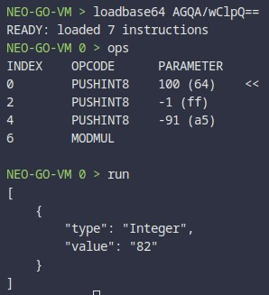

# MODMUL operation returns wrong results for negative numbers

## Minimal case

```text
AGQA/wClpQ==
```

## What is wrong

For negative numbers MODMUL operation returns wrong results.

```text
100 * -1 % -91 == 82
```



## Expected behavior

C# (neo) results:

```text
100 * -1 % -91 == -9
```

## Extra info

Relevant for Commit (neo-go): `c960a7eb4799ffa1cf8a5428a91d9fb2c86ac69e`
