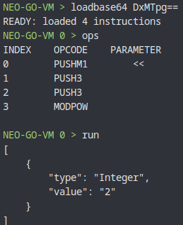

# MODPOW operation returns wrong results for negative numbers

## Minimal case

```text
DxMTpg==
```

## What is wrong

For negative base MODPOW operation returns wrong results.

```text
(-1 ^ 3) % 3 == 2
```



## Expected behavior

C# (neo) results:

```text
(-1 ^ 3) % 3 == -1
```

## Extra info

Relevant for Commit (neo-go): `a9242535db757faba860e21c194033f30c679f48`
