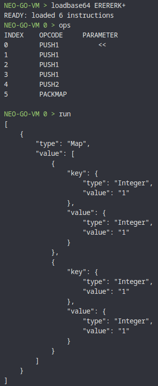

# PACKMAP operation keeps duplicate entries

## Minimal case

```text
ERERERK+
```

## What is wrong

PACKMAP operations keeps duplicate keys (and entries).

```json
[
  {
    "type": "Map",
    "value": [
      {
        "key": {
          "type": "Integer",
          "value": "1"
        },
        "value": {
          "type": "Integer",
          "value": "1"
        }
      },
      {
        "key": {
          "type": "Integer",
          "value": "1"
        },
        "value": {
          "type": "Integer",
          "value": "1"
        }
      }
    ]
  }
]
```



## Expected behavior

C# (neo) results:

```json
[
  {
    "type": "Map",
    "value": [
      {
        "key": {
          "type": "Integer",
          "value": "1"
        },
        "value": {
          "type": "Integer",
          "value": "1"
        }
      }
    ]
  }
]
```

## Extra info

Relevant for Commit (neo-go): `a9242535db757faba860e21c194033f30c679f48`
